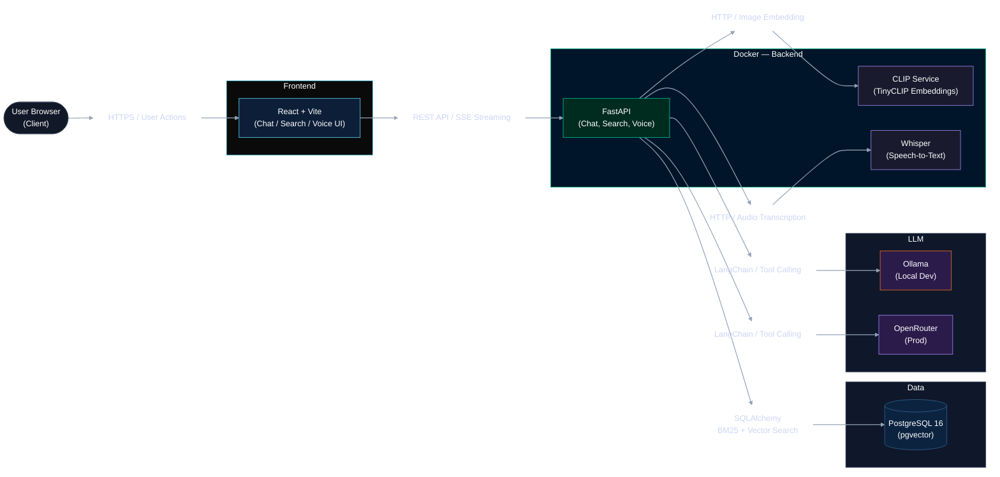

# AI Agent for Steam

Amazon Rufus, but for Steam. A conversational AI assistant that helps gamers discover games from the Steam catalog using natural language, image search, and voice input.

## Features
- **Chat agent** — conversational game recommendations with session memory, streaming responses, and a relaxed gamer persona (always in English)
- **Text search** — hybrid BM25 + vector search with cross-encoder reranking
- **Image search** — upload a screenshot or artwork to find visually similar games (CLIP)
- **Voice input** — speak your query using Whisper transcription (local in dev, OpenAI API in prod)
- **Live Steam data** — agent can pull real-time prices, discounts, player counts, and game details from the Steam API
- **Chain-of-thought** — collapsible reasoning panel showing tool calls and agent steps in real time
- **Game screenshots** — product cards show header image and screenshot thumbnails from the Steam catalog
- **Deterministic card ordering** — product cards are reordered to match the order games appear in the agent's response

## Architecture

React frontend talks to a FastAPI backend that routes queries through a hybrid search pipeline (BM25 + pgvector), a TinyCLIP image embedding service, a Whisper speech-to-text service, and a LangChain chat agent backed by Ollama locally or OpenRouter in production.



| Service | Port | Description |
|---------|------|-------------|
| **fe** | 5173 | React + Vite + TypeScript frontend |
| **api** | 8000 | FastAPI backend (chat, search, voice) |
| **clip-service** | 8001 | TinyCLIP image/text embedding service |
| **whisper** | 9000 | Whisper ASR speech-to-text (tiny.en) |
| **db** | 5432 | PostgreSQL 16 + pgvector |

**Search pipeline:**
- Text queries use BM25 (keyword) + sentence-transformer vector search fused via RRF, then reranked by a cross-encoder to top 3
- Image queries use TinyCLIP to embed the uploaded image and search the `image_embedding` column via pgvector cosine distance
- The chat agent uses LangChain tool calling with session memory, streaming via SSE
- Product cards are deterministically reordered after the LLM responds, matching the order games are mentioned in the text

**Agent tools:**
- `product_search_tool` — hybrid retrieval over the local catalog (always called before any recommendation)
- `steam_game_details_tool` — live price, player count, Metacritic, reviews, and platform info from Steam
- `steam_price_tool` — current price and active discounts
- `steam_player_count_tool` — live concurrent player count

**LLM:**
- Dev: Ollama (local) — defaults to `qwen2.5:7b` (swap via `OLLAMA_MODEL` env var, e.g. `gemma3:27b`)
- Prod: OpenRouter — defaults to `anthropic/claude-3.5-haiku` (swap via `OPENROUTER_MODEL`)

## Prerequisites

- [Docker](https://docs.docker.com/get-docker/) and Docker Compose
- [Ollama](https://ollama.com) installed and running locally (dev)
- An [OpenRouter](https://openrouter.ai) API key (prod)

## Setup

1. **Clone the repo**

   ```bash
   git clone <repo-url>
   cd ai-agent-ecomm
   ```

2. **Pull the Ollama model** (dev only)

   ```bash
   ollama pull qwen2.5:7b
   # or for better quality at the cost of speed:
   ollama pull gemma3:27b
   ```

3. **Configure environment variables**

   ```bash
   cp be/.env.example be/.env
   ```

   For production, add your OpenRouter key to `be/.env`:

   ```
   OPENROUTER_API_KEY=sk-or-your-key-here
   ```

4. **Start all services**

   ```bash
   docker compose -f docker-compose.dev.yml up --build -d
   ```

   Wait for all health checks to pass. The clip-service takes ~60s on first start to download the model. Check status with:

   ```bash
   docker compose -f docker-compose.dev.yml ps
   ```

5. **Seed the database**

   ```bash
   docker compose -f docker-compose.dev.yml exec api python -m migrations.seed --limit 200
   ```

   This will:
   - Download the Steam games dataset from HuggingFace (cached to `/tmp/steam_games.parquet`)
   - Insert the top N games by estimated owners into the `games` table
   - Generate sentence embeddings using `all-MiniLM-L6-v2`
   - Download header images and generate CLIP embeddings via the clip-service
   - Insert everything into the `products` table

   Use `--limit N` to seed fewer games for faster startup. Omit for the full 5000.

6. **Open the app**

   Visit [http://localhost:5173](http://localhost:5173)

## Useful Commands

```bash
# Rebuild and restart a single service
docker compose -f docker-compose.dev.yml up -d --build api

# View logs
docker compose -f docker-compose.dev.yml logs -f api

# Re-seed after wiping products
docker compose -f docker-compose.dev.yml exec db psql -U postgres ecomm -c "TRUNCATE products;"
docker compose -f docker-compose.dev.yml exec api python -m migrations.seed --limit 200

# Check embedding coverage
docker compose -f docker-compose.dev.yml exec db psql -U postgres ecomm -c \
  "SELECT COUNT(*) total, COUNT(image_embedding) with_image, COUNT(text_embedding) with_text FROM products;"

# Connect to the database
docker compose -f docker-compose.dev.yml exec db psql -U postgres -d ecomm

# Stop services
docker compose -f docker-compose.dev.yml down

# Reset everything (deletes all data and volumes)
docker compose -f docker-compose.dev.yml down -v
```
